Android 动画详解

------


## 概述

总结归纳Android动画相关知识点，并实践验证真知！


坚决不重复造轮子，这位大神的作品写的十分详细，总结的很到位。

本文中的大多数图片也来自下面的博客，侵删！

[Android动画：献上一份详细 & 全面的动画知识学习攻略](https://www.jianshu.com/p/53759778284a)

学习三部曲： 
    
    总结成自己的语言 -> 结合实例验证如何使用 -> 思考应用场景


## 实例

    纸上得来终觉浅，绝知此事要躬行！

[Demo](./code)


## 总结

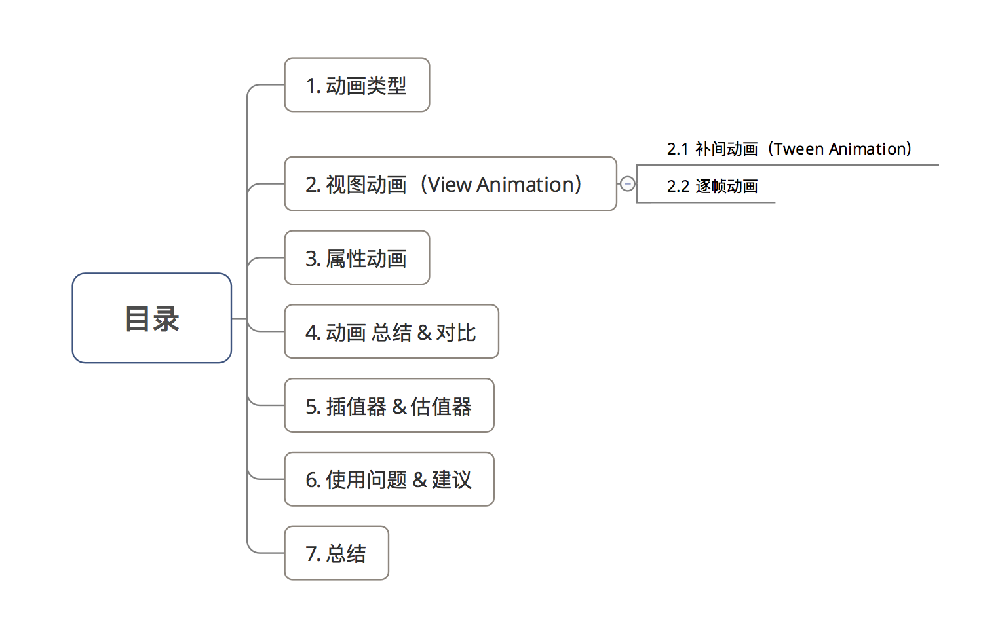

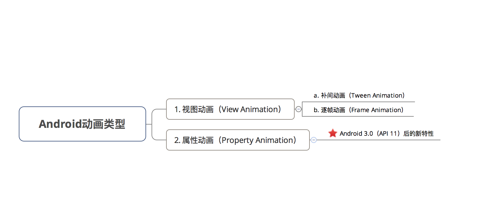

### 视图动画(View Animation)

#### 帧动画(Frame Animation)
   
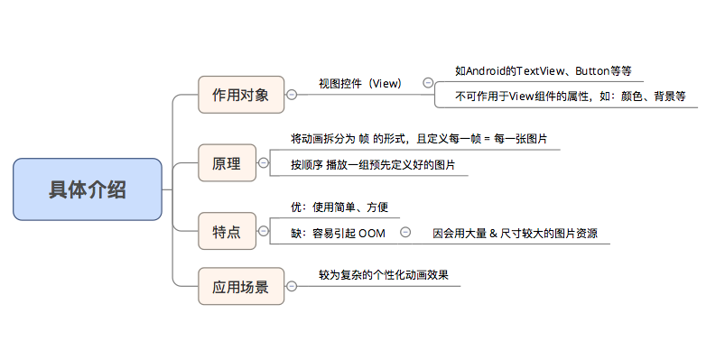

使用步骤：

    1. 将动画资源（即每张图片资源）放到 drawable文件夹里
    2. 设置 & 启动 动画: xml/java
       2.1 XML实现
        步骤1：在 res/anim的文件夹里创建动画效果.xml文件
        步骤2：设置动画资源
        步骤3：在Java代码中载入 & 启动动画
       2.2 Java实现
    
主要代码：

XML实现
```
  
   ImageView imageView = (ImageView) findViewById(R.id.imageView);
 
 <-- 开始动画 -->

// 1. 设置动画
imageView.setImageResource(R.drawable.walker);

// 2. 获取动画对象
animationDrawable = (AnimationDrawable) imageView.getDrawable();  

// 3. 启动动画
animationDrawable.start(); 

<!-- 停止动画 -->
// 1. 设置动画
imageView.setImageResource(R.drawable.kwalker);  
 
// 2. 获取动画对象 
animationDrawable = (AnimationDrawable) imageView.getDrawable();

// 3. 暂停动画
animationDrawable.stop(); 

```

Java实现：

```
 <-- 直接从drawable文件夹获取动画资源（图片） --> 
        animationDrawable = new AnimationDrawable();
        for (int i = 0; i <= 37; i++) {
            int id = getResources().getIdentifier("to" + i, "drawable", getPackageName());
            Drawable drawable = getResources().getDrawable(id);
            animationDrawable.addFrame(drawable, 100);
        }

<-- 开始动画 -->

 animationDrawable.setOneShot(true);

 imageView.setImageDrawable(animationDrawable); // 获取资源对象 
 
 animationDrawable.stop(); // 特别注意：在动画start()之前要先stop()，不然在第一次动画之后会停在最后一帧，这样动画就只会触发一次 
 
 animationDrawable.start(); // 启动动画

<-- 停止动画 -->

    animationDrawable.setOneShot(true);
    imageView.setImageDrawable(animationDrawable);
    animationDrawable.stop();
```

Tips:

    找到自己需要的gif动画
    用 gif分解软件（如 GifSplitter）将 gif 分解成一张张图片即可
    ubuntu安装了ImageMagick可以使用下面的命令：convert from.gif to.png


AnimatedVectorDrawable
    
    如果图片资源是矢量图，则使用AnimatedVectorDrawable

```
<!-- res/drawable/vectordrawable.xml -->
<vector xmlns:android="http://schemas.android.com/apk/res/android"
    android:height="64dp"
    android:width="64dp"
    android:viewportHeight="600"
    android:viewportWidth="600">
    <group
        android:name="rotationGroup"
        android:pivotX="300.0"
        android:pivotY="300.0"
        android:rotation="45.0" >
        <path
            android:name="v"
            android:fillColor="#000000"
            android:pathData="M300,70 l 0,-70 70,70 0,0 -70,70z" />
    </group>
</vector>
```

```
<!-- res/drawable/animvectordrawable.xml -->
<animated-vector xmlns:android="http://schemas.android.com/apk/res/android"
  android:drawable="@drawable/vectordrawable" >
    <target
        android:name="rotationGroup"
        android:animation="@anim/rotation" />
    <target
        android:name="v"
        android:animation="@anim/path_morph" />
</animated-vector>
```

```
<!-- res/anim/rotation.xml -->
<objectAnimator
    android:duration="6000"
    android:propertyName="rotation"
    android:valueFrom="0"
    android:valueTo="360" />
```

```
<!-- res/anim/path_morph.xml -->
<set xmlns:android="http://schemas.android.com/apk/res/android">
    <objectAnimator
        android:duration="3000"
        android:propertyName="pathData"
        android:valueFrom="M300,70 l 0,-70 70,70 0,0   -70,70z"
        android:valueTo="M300,70 l 0,-70 70,0  0,140 -70,0 z"
        android:valueType="pathType" />
</set>
```

详见 [Android官方文档|Animate drawable graphics ](https://developer.android.google.cn/guide/topics/graphics/drawable-animation)

#### 补间动画（Tween Animation）

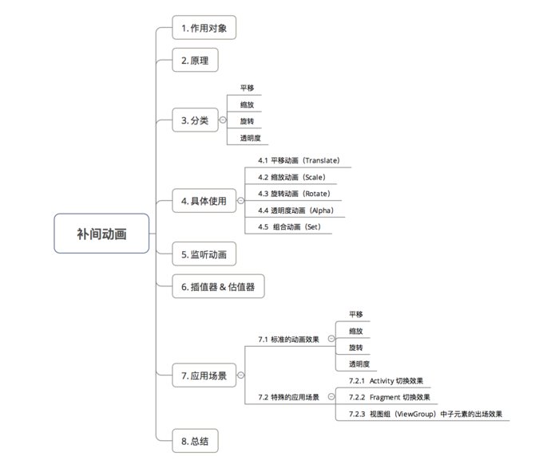

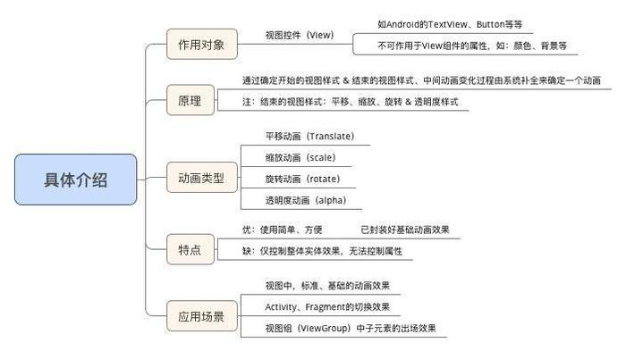

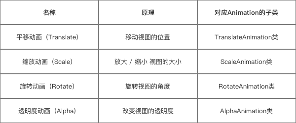

分类：

根据不同的动画效果，补间动画分为4种动画：

    平移动画（Translate）
    缩放动画（scale）
    旋转动画（rotate）
    透明度动画（alpha）

具体使用：


补间动画的使用方式分为两种：在XML 代码 / Java 代码里设置

        前者优点：动画描述的可读性更好
        后者优点：动画效果可动态创建

**XML 实现**


平移动画（Translate）

```

Animation animation = AnimationUtils.loadAnimation(mContext, R.anim.alpha_anim); img = (ImageView) findViewById(R.id.img); img.startAnimation(animation);

```
缩放动画（scale）
```
<?xml version="1.0" encoding="utf-8"?> <scale xmlns:android="http://schemas.android.com/apk/res/android" android:duration="1000"
android:fromXScale="0.0"
android:fromYScale="0.0"
android:pivotX="50%"
android:pivotY="50%"
android:toXScale="1.0"
android:toYScale="1.0"/>

```

旋转动画（rotate）

透明度动画（alpha）
```
<?xml version="1.0" encoding="utf-8"?> <alpha xmlns:android="http://schemas.android.com/apk/res/android" android:duration="1000"
android:fromAlpha="1.0" android:interpolator="@android:anim/accelerate_decelerate_interpolato"
android:toAlpha="0.0" />

```

组合动画

    使用组合动画需要用到标签 < Set/> 

XML:

```
// 步骤1:创建 需要设置动画的 视图View 
Button mButton = (Button) findViewById(R.id.Button);

// 步骤2:创建 动画对象 并传入设置的动画效果xml文件 
 Animation translateAnimation = AnimationUtils.loadAnimation(this, R.anim.view_animation);

// 步骤3:播放动画
Button.startAnimation(translateAnimation);

```

Java
```
// 创建 需要设置动画的 视图View 
Button mButton = (Button) findViewById(R.id.Button) 

// 组合动画设置 

        AnimationSet setAnimation = new AnimationSet(true);// 步骤1:创建组合动画对象(设置为true)

        // 步骤2:设置组合动画的属性
        // 特别说明以下情况
        // 因为在下面的旋转动画设置了无限循环(RepeatCount = INFINITE)
        // 所以动画不会结束，而是无限循环
        // 所以组合动画的下面两行设置是无效的 
        setAnimation.setRepeatMode(Animation.RESTART);
        setAnimation.setRepeatCount(1);// 设置了循环一次,但无效 

        // 步骤3:逐个创建子动画(方式同单个动画创建方式,此处不作过多描述)

        // 子动画1:旋转动画
        Animation rotate = new RotateAnimation(0, 360, Animation.RELATIVE_TO_SELF, 0.5f, Animation.RELATIVE_TO_SELF, 0.5f);
        rotate.setDuration(1000);
        rotate.setRepeatMode(Animation.RESTART);
        rotate.setRepeatCount(Animation.INFINITE);

        // 子动画2:平移动画
        Animation translate = new TranslateAnimation(TranslateAnimation.RELATIVE_TO_PARENT, -0.5f, TranslateAnimation.RELATIVE_TO_PARENT, 0.5f, TranslateAnimation.RELATIVE_TO_SELF, 0, TranslateAnimation.RELATIVE_TO_SELF, 0);

        translate.setDuration(10000);

        // 子动画3:透明度动画 
        Animation alpha = new AlphaAnimation(1, 0);
        alpha.setDuration(3000);
        alpha.setStartOffset(7000);

        // 子动画4:缩放动画 
        Animation scale1 = new ScaleAnimation(1, 0.5f, 1, 0.5f, Animation.RELATIVE_TO_SELF, 0.5f, Animation.RELATIVE_TO_SELF, 0.5f);
        scale1.setDuration(1000);
        scale1.setStartOffset(4000);

        // 步骤4:将创建的子动画添加到组合动画里
        setAnimation.addAnimation(alpha);
        setAnimation.addAnimation(rotate);
        setAnimation.addAnimation(translate);
        setAnimation.addAnimation(scale1);

        mButton.startAnimation(setAnimation); // 步骤5:播放动画

```

    Interpolator 主要作用是可以控制动画的变化速率 ，就是动画进行的快慢节奏。

    pivot 决定了当前动画执行的参考位置


监听动画

Animation类通过监听动画开始 / 结束 / 重复时刻来进行一系列操作，如跳转页面等等
    通过在 Java 代码里setAnimationListener()方法设置

```
Animation.setAnimationListener(new Animation.AnimationListener() {
            @Override
            public void onAnimationStart(Animation animation) {
                // 动画开始时回调
            }

            @Override
            public void onAnimationEnd(Animation animation) {
                // 动画结束时回调
            }

            @Override
            public void onAnimationRepeat(Animation animation) {
                //动画重复执行的时候回调
            }
        });
```
**特别注意**

若采取上述方法监听动画，每次监听都必须重写4个方法。

    背景：有些时候我们并不需要监听动画的所有时刻
    问题：但上述方式是必须需要重写4个时刻的方法，这显示太累赘
    解决方案：采用动画适配器AnimatorListenerAdapter，解决实现接口繁琐的问题

具体如下：
```
anim.addListener(new AnimatorListenerAdapter() {  
// 向addListener()方法中传入适配器对象AnimatorListenerAdapter()
// 由于AnimatorListenerAdapter中已经实现好每个接口
// 所以这里不实现全部方法也不会报错
    @Override  
    public void onAnimationStart(Animator animation) {  
    // 如想只想监听动画开始时刻，就只需要单独重写该方法就可以
    }  
});
```

**应用场景**

标准的动画效果

    补间动画常用于视图View的一些标准动画效果：平移、旋转、缩放 & 透明度；
    除了常规的动画使用，补间动画还有一些特殊的应用场景。

特殊的应用场景

    Activity 的切换效果
    Fragement 的切换效果
    视图组（ViewGroup）中子元素的出场效果

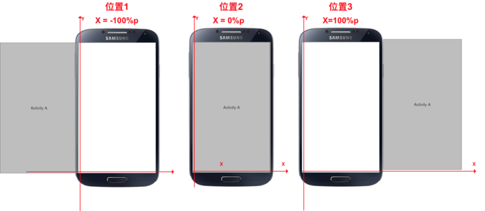

### 属性动画（Property Animation）


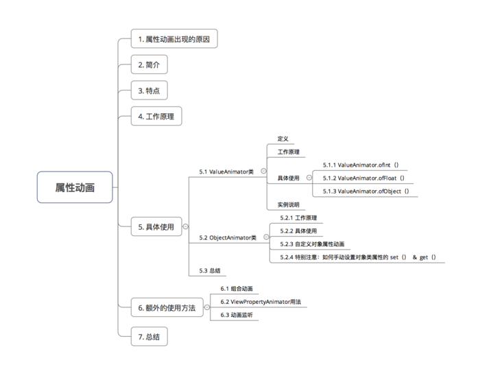


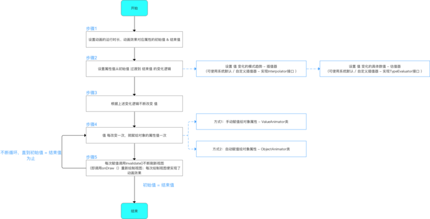


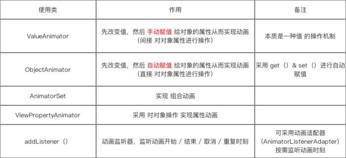


#### ValueAnimator

    定义：属性动画机制中 最核心的一个类

    实现动画的原理：通过不断控制 值 的变化，再不断 手动 赋给对象的属性，从而实现动画效果。

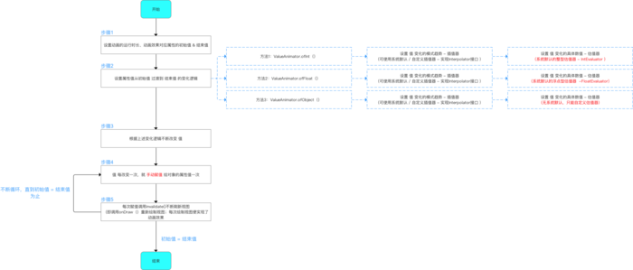


ValueAnimator类中有3个重要方法：

    ValueAnimator.ofInt（int values）
    ValueAnimator.ofFloat（float values）
    ValueAnimator.ofObject（int values）


```
        // 步骤1：设置动画属性的初始值 & 结束值
        ValueAnimator anim = ValueAnimator.ofInt(0, 3);
        // ofInt（）作用有两个
        // 1. 创建动画实例
        // 2. 将传入的多个Int参数进行平滑过渡:此处传入0和1,表示将值从0平滑过渡到1
        // 如果传入了3个Int参数 a,b,c ,则是先从a平滑过渡到b,再从b平滑过渡到C，以此类推
        // ValueAnimator.ofInt()内置了整型估值器,直接采用默认的.不需要设置，即默认设置了如何从初始值 过渡到 结束值
        // 关于自定义插值器我将在下节进行讲解
        // 下面看看ofInt()的源码分析 ->>关注1
        // 步骤2：设置动画的播放各种属性
        anim.setDuration(500); // 设置动画运行的时长
        anim.setStartDelay(500); // 设置动画延迟播放时间
        anim.setRepeatCount(0); // 设置动画重复播放次数 = 重放次数+1
        // 动画播放次数 = infinite时,动画无限重复
        anim.setRepeatMode(ValueAnimator.RESTART); // 设置重复播放动画模式
        // ValueAnimator.RESTART(默认):正序重放
        // ValueAnimator.REVERSE:倒序回放
        //
        // 步骤3：将改变的值手动赋值给对象的属性值：通过动画的更新监听器
        // 设置 值的更新监听器
        // 即：值每次改变、变化一次,该方法就会被调用一次
        anim.addUpdateListener(new ValueAnimator.AnimatorUpdateListener() {
            @Override
            public void onAnimationUpdate(ValueAnimator animation) {
                int currentValue = (Integer) animation.getAnimatedValue();
                // 获得改变后的值
                System.out.println(currentValue); // 输出改变后的值 
                // 步骤4：将改变后的值赋给对象的属性值，下面会详细说明
                View.setproperty(currentValue); 
                // 步骤5：刷新视图，即重新绘制，从而实现动画效果
                View.requestLayout();
            }
        });
        anim.start(); // 启动动画
    }

    // 关注1：ofInt（）源码分析
    public static ValueAnimator ofInt(int... values) {
        // 允许传入一个或多个Int参数
        // 1. 输入一个的情况（如a）：从0过渡到a；
        // 2. 输入多个的情况（如a，b，c）：先从a平滑过渡到b，再从b平滑过渡到C
        ValueAnimator anim = new ValueAnimator(); // 创建动画对象
        anim.setIntValues(values); // 将传入的值赋值给动画对象
        return anim;
    }
```

#### 估值器（TypeEvaluator）

作用：设置动画 如何从初始值 过渡到 结束值 的逻辑

    插值器（Interpolator）决定 值 的变化模式（匀速、加速blabla）
    估值器（TypeEvaluator）决定 值 的具体变化数值

FloatEvaluator

```

```

对于ValueAnimator.ofObject（），我们需自定义估值器（TypeEvaluator）来告知系统如何进行从 初始对象 过渡到 结束对象的逻辑

    重写TypeEvaluator的evaluate方法

#### ObjectAnimator

直接对对象的属性值进行改变操作，从而实现动画效果

ObjectAnimator与 ValueAnimator类的区别：


    ValueAnimator 类是先改变值，然后 手动赋值 给对象的属性从而实现动画；是 间接 对对象属性进行操作；
    ObjectAnimator 类是先改变值，然后 自动赋值 给对象的属性从而实现动画；是 直接 对对象属性进行操作；


    可以理解为：ObjectAnimator更加智能、自动化程度更高


ObjectAnimator 类 对 对象属性值 进行改变从而实现动画效果的本质是
    
    通过不断控制值的变化，再不断自动赋给对象的属性，从而实现动画效果

    自动赋给对象的属性的本质是调用该对象属性的set（） & get（）方法进行赋值

自动赋值的逻辑：

    初始化时，如果属性的初始值没有提供，则调用属性的 get（）进行取值；
    当 值 变化时，用对象该属性的 set（）方法，从而从而将新的属性值设置给对象属性


自定义对象属性实现动画效果


    为对象设置需要操作属性的set（） & get（）方法
    通过实现TypeEvaluator类从而定义属性变化的逻辑

设置对象类属性的set（） & get（）方法

设置对象类属性的set（） & get（）有两种方法：

    通过继承原始类，直接给类加上该属性的 get（）& set（），从而实现给对象加上该属性的 get（）& set（）

    通过包装原始动画对象，间接给对象加上该属性的 get（）&
    set（）。即 用一个类来包装原始对象

```

        MyView2 myView2 = (MyView2) findViewById(R.id.MyView2);
        ObjectAnimator anim = ObjectAnimator.ofObject(myView2, "color", new ColorEvaluator(), "#0000FF", "#FF0000");
        // 设置自定义View对象、背景颜色属性值 & 颜色估值器 

        // 本质逻辑：
        // 步骤1：根据颜色估值器不断 改变 值 
        // 步骤2：调用set（）设置背景颜色的属性值（实际上是通过画笔进行颜色设置）
        // 步骤3：调用invalidate()刷新视图，即调用onDraw（）重新绘制，从而实现动画效果 

        anim.setDuration(8000);
        anim.start();
```

通过包装原始动画对象，间接给对象加上该属性的 get（）& set（）

    本质上是采用了设计模式中的装饰模式，即通过包装类从而扩展对象的功能

```
        private static class ViewWrapper {
            private View mTarget;

            // 构造方法:传入需要包装的对象
            public ViewWrapper(View target) {
                mTarget = target;
            }

            // 为宽度设置get（） & set（） 
            public int getWidth() {
                return mTarget.getLayoutParams().width;
            }

            public void setWidth(int width) {
                mTarget.getLayoutParams().width = width;
                mTarget.requestLayout();
            }
        }

```

#### 组合动画（AnimatorSet）


    单一动画实现的效果相当有限，更多的使用场景是同时使用多种动画效果，即组合动画
    实现 
    组合动画的功能：AnimatorSet类

```
        AnimatorSet.play(Animator anim) ：播放当前动画 
        AnimatorSet.after(long delay) ：将现有动画延迟x毫秒后执行 
        AnimatorSet.with(Animator anim) ：将现有动画和传入的动画同时执行 
        AnimatorSet.after(Animator anim) ：将现有动画插入到传入的动画之后执行 
        AnimatorSet.before(Animator anim) ： 将现有动画插入到传入的动画之前执行
```

#### ViewPropertyAnimator

    可认为是属性动画的一种简写方式

```
// 使用解析
View.animate().xxx().xxx();

mButton.animate().alpha(0f);
```

#### 监听动画

```
// 特别注意：每次监听必须4个方法都重写。
        Animation.addListener(new AnimatorListener() {
            @Override
            public void onAnimationStart(Animation animation) {
                //动画开始时执行
            }

            @Override
            public void onAnimationRepeat(Animation animation) {
                //动画重复时执行 
            }

            @Override
            public void onAnimationCancel()(
            Animation animation)

            {
                //动画取消时执行 
            }

            @Override
            public void onAnimationEnd(Animation animation) {
                //动画结束时执行 
            }
        });
    }
```

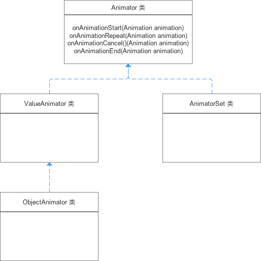

    AnimatorSet类、ValueAnimator、ObjectAnimator都可以使用addListener()监听器进行动画监听

动画适配器AnimatorListenerAdapter

    背景：有些时候我们并不需要监听动画的所有时刻
    问题：但addListener(new AnimatorListener())监听器是必须重写4个时刻方法，这使得接口方法重写太累赘
    解决方案：采用动画适配器（AnimatorListenerAdapter），解决实现接口繁琐 的问题

```
        anim.addListener(new AnimatorListenerAdapter() {
            // 向addListener()方法中传入适配器对象AnimatorListenerAdapter() 
            // 由于AnimatorListenerAdapter中已经实现好每个接口 
            // 所以这里不实现全部方法也不会报错 
            @Override
            public void onAnimationStart(Animator animation) {
                // 如想只想监听动画开始时刻，就只需要单独重写该方法就可以 
                /}
        });
    }
```


## 参考文档

[Android动画：献上一份详细 & 全面的动画知识学习攻略](https://www.jianshu.com/p/53759778284a)