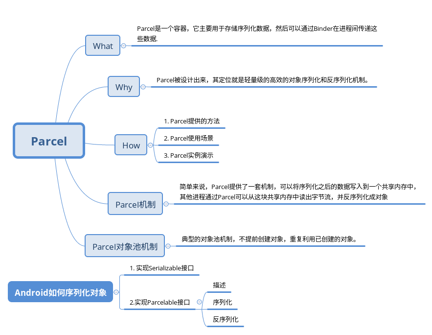
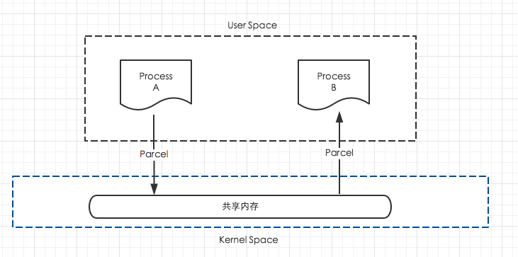

Android中的Parcel机制
--------------

## 概述



分析所有问题的思路，都可以从下面三个经典问题入手：

What? Why? How? 

下面我们围绕这这个三个分析来详细分析Parcel.

什么是Parcel? 

为什么需要Parcel?

如何使用Parcel?


## 什么是Parcel

Parcel，翻译过来是“打包”的意思。

看一下Android官方的定义

    Container for a message (data and object references) that can be sent through an IBinder. A Parcel can contain both flattened data that will be unflattened on the other side of the IPC (using the various methods here for writing specific types, or the general Parcelable interface), and references to live IBinder objects that will result in the other side receiving a proxy IBinder connected with the original IBinder in the Parcel. 

简单翻译下就是：Parcel是一个容器，它主要用于存储序列化数据，然后可以通过Binder在进程间传递这些数据.

    Note：Parcel is not a general-purpose serialization mechanism. This class (and the corresponding Parcelable API for placing arbitrary objects into a Parcel) is designed as a high-performance IPC transport. As such, it is not appropriate to place any Parcel data in to persistent storage: changes in the underlying implementation of any of the data in the Parcel can render older data unreadable.
    
Parcel不是一般目的的序列化机制。这个类被设计用于高性能的IPC传输。因此不适合把Parcel写入永久化存储中，因为Parcel中的数据类型的实现的改变会导致旧版的数据不可读。

## 为什么需要Parcel?

再进一步分析Parcel之前，我们先思考一个问题： 为什么需要Parcel？

答案是为了序列化。

序列化：把Java对象转换为字节序列的过程。
反序列化：把字节序列恢复为Java对象的过程。

    如果要在进程之间传递一个整数，很简单，直接传就是行了；
    如果要传一个字符串，就稍微复杂了点：需先分配一块可以容纳字符串的内存，然后将字符串复制到内存中，再传递；
    再如果要传递一个类的实例呢？也是先为类分配内存，然后复制一份再传递可以吗？
    我们知道类中成员除了属性还有方法，即使属性能完整传过去，但还有方法呢？方法是独立于类对象存在的，所以到另一个进程中再引用同一个方法就要出错了，还是因为独立地址空间的原因。

序列化机制的解决方案：

1.保存到磁盘的所有对象都获得一个序列号(1, 2, 3等等)

2.当要保存一个对象时，先检查该对象是否被保存了

3.如果以前保存过，只需写入"与已经保存的具有序列号x的对象相同"的标记，否则，保存该对象

通过以上的步骤序列化机制解决了对象引用的问题。


归纳来说就是因为进程间内存地址独立，无法相互访问，传递各种数据时的对象引用问题难以处理，序列化就是为了解决这种问题而生的。

为了在不同进程间传递数据，将对象序列化为流的形式进行传输。

### Java中的Serialize
    
    我们都知道JAVA中的Serialize机制，译成串行化、序列化……，其作用是能将数据对象存入字节流当中，在需要时重新生成对象。主要应用是利用外部存储设备保存对象状态，以及通过网络传输对象等。

既然Java已经有了序列化的机制Serialize，为什么Android还有重复造轮子呢？

原因如下：

    在Android系统中，定位为针对内存受限的设备，因此对性能要求更高，另外系统中采用了新的IPC（进程间通信）机制，必然要求使用性能更出色的对象传输方式。在这样的环境下，Parcel被设计出来，其定位就是轻量级的高效的对象序列化和反序列化机制。

## 如何使用Parcel
好了，我们现在知道什么是Parcel,为什么需要Parcel了，那么Parcel具体怎么用呢？

### Parcel提供的方法

    The bulk of the Parcel API revolves around reading and writing data of various types. There are six major classes of such functions available.

Parcel的一堆的API用于解决不同类型数据的读写。这些函数们主要有六种类型。

#### 原始类

    The most basic data functions are for writing and reading primitive data types: writeByte(byte), readByte(), writeDouble(double), readDouble(), writeFloat(float), readFloat(), writeInt(int), readInt(), writeLong(long), readLong(), writeString(String), readString(). Most other data operations are built on top of these. The given data is written and read using the endianess of the host CPU.

这类方法们主要读写原始数据类型。它们是：
```
writeByte(byte), readByte(), 
writeDouble(double), readDouble(), 
writeFloat(float), readFloat(), 
writeInt(int), readInt(), 
writeLong(long), readLong(), 
writeString(String), readString().
```

大多数其它数据的操作都是基于这些方法。

#### 原始数组类

    There are a variety of methods for reading and writing raw arrays of primitive objects, which generally result in writing a 4-byte length followed by the primitive data items. The methods for reading can either read the data into an existing array, or create and return a new array. These available types are:

这类方法用于读写原始数据组成的数组。在向数组写数据时先写入数组的长度再写入数据。读数组的方法可以将数据读到已存在的数组中，也可以创建并返回一个新数组。它们是：

    writeBooleanArray(boolean[]), readBooleanArray(boolean[]), createBooleanArray()
    writeByteArray(byte[]), writeByteArray(byte[], int, int), readByteArray(byte[]), createByteArray()
    writeCharArray(char[]), readCharArray(char[]), createCharArray()
    writeDoubleArray(double[]), readDoubleArray(double[]), createDoubleArray()
    writeFloatArray(float[]), readFloatArray(float[]), createFloatArray()
    writeIntArray(int[]), readIntArray(int[]), createIntArray()
    writeLongArray(long[]), readLongArray(long[]), createLongArray()
    writeStringArray(String[]), readStringArray(String[]), createStringArray().
    writeSparseBooleanArray(SparseBooleanArray), readSparseBooleanArray(). 

#### Parcelable类

    Parcelable为对象从Parcel中读写自己提供了极其高效的协议。你可以使用直接的方法 writeParcelable(Parcelable, int) 和 readParcelable(ClassLoader) 或 writeParcelableArray(T[], int) and readParcelableArray(ClassLoader) 进行读写。这些方法们把类的信息和数据都写入Parcel，以使将来能使用合适的类装载器重新构造类的实例。

    还有一些方法提供了更高效的操作Parcelable们的途径，它们是：writeTypedArray(T[], int), writeTypedList(List), readTypedArray(T[], Parcelable.Creator) and readTypedList(List, Parcelable.Creator)。这些方法不会写入类的信息，取而代之的是：读取时必须能知道数据属于哪个类并传入正确的Parcelable.Creator来创建对象而不是直接构造新对象。（更加高效的读写单个Parcelable对象的方法是：直接调用Parcelable.writeToParcel()和Parcelable.Creator.createFromParcel()）

####  Bundles类

    Bundles是一种类型安全的Map型容器，可用于存储任何不同类型的数据。它具有很多对讀写数据的性能优化，并且它的类型安全机制避免了当把它的数据封送到Parcel中时由于类型错误引起的BUG的调试的麻烦，可以使用的方法为： writeBundle(Bundle), readBundle(), and readBundle(ClassLoader)。

#### 活动对象类

    Parcel的一个非同寻常的特性是读写活对象的能力。对于活动对象，它们的内容实际上并没有写入，而是仅写入了一个令牌来引用这个对象。当从Parcel中读取这个对象时，你不会获取一个新的对象实例，而是直接得到那个写入的对象。有两种活动对象可操作：

    Binder对象。它是Android跨进程通讯的基础。这种对象可被写入Parcel，并在读取时你将得到原始的对象或一个代理对象（可以想象：在进程内时得到原始的对象，在进程间时得到代理对象）。可以使用的方法们是： writeStrongBinder(IBinder), writeStrongInterface(IInterface), readStrongBinder(), writeBinderArray(IBinder[]), readBinderArray(IBinder[]), createBinderArray(), writeBinderList(List), readBinderList(List), createBinderArrayList()。

    FileDescriptor对象。它代表了原始的Linux文件描述符，它可以被写入Parcel并在读取时返回一个ParcelFileDescriptor对象用于操作原始的文件描述符。ParcelFileDescriptor是原始描述符的一个复制：对象和fd不同，但是都操作于同一文件流，使用同一个文件位置指针，等等。可以使用的方法是：writeFileDescriptor(FileDescriptor), readFileDescriptor()。

#### 无类型容器类

    一类final方法，用于读写标准的java容器类。这些方法们是：writeArray(Object[]), readArray(ClassLoader), writeList(List), readList(List, ClassLoader), readArrayList(ClassLoader), writeMap(Map), readMap(Map, ClassLoader), writeSparseArray(SparseArray), readSparseArray(ClassLoader)。

### 使用场景

Parcel的典型使用方法

```
// 写

// 从Parcel对象池中获取一个Parcel对象
Parcel parcel = Parcel.obtain(); 
// 写数据
parcel.writeInt(1); 
parcel.writeLong(1000);
parcel.writeString("test");

// 在完成了数据的写入之后，就需要进行数据的序列化
parcel.marshall();

在经过上一步的处理之后，返回了一个byte数组，主要的IPC相关的操作主要就是围绕此byte数组进行的。同时，由于parcel的读写都是一个指针操作的，这一步涉及到native的操作，所以，在将数据写入之后，需要将指针手动指向到最初的位置，即如下的操作：

parcel.setDataPosition(0); // 将指针移到开始位置

// 回收Parcel

parcel.recycle();

传递的过程不做说明，看一下如何读取数据：

// 反序列化

parcel.unmarshall(byte[] data, int offest, int length);

其中的参数分别是这个byte数组，以及读取偏移量，以及数组的长度。

此时得到的parcel就是一个正常的parcel对象，这时就可以将之前我们所存入的数据按照顺序进行获取<，即：

parcel.readInt(); // 写数据
parcel.readLong();
parcel.readString();

读取完毕之后，同样是一个parcel的回收操作：

parcel.recycle();
```

## Android中如何序列化对象

Android序列化对象主要有两种方法：

1. 实现Serializable接口
2. 实现Parcelable接口。

实现Serializable接口是Java SE本身就支持的，而Parcelable是Android特有的功能，效率比实现Serializable接口高，而且还可以用在IPC中。
实现Serializable接口非常简单，声明一下就可以了，而实现Parcelable接口稍微复杂一些，但效率更高，推荐用这种方法提高性能。

下面就介绍一下实现Parcelable接口的方法

### Parcelable

先看一下Android官方的注释：
    
    Interface for classes whose instances can be written to
    and restored from a {@link Parcel}.  Classes implementing the Parcelable
    interface must also have a non-null static field called <code>CREATOR</code>
    of a type that implements the {@link Parcelable.Creator} interface.

Parcelable通过Parcel实现了read和write的方法,从而实现序列化和反序列化。

我们可以通过实现Parcelable接口将类序列化

通过实现Parcelable接口序列化对象的步骤：
        
        1、声明实现接口Parcelable
        2、实现Parcelable的方法writeToParcel，将你的对象序列化为一个Parcel对象
        3、实例化静态内部对象CREATOR实现接口Parcelable.Creator：
        4、完成CREATOR的代码，实现方法createFromParcel，将Parcel对象反序列化为你的对象

简而言之：通过writeToParcel将你的对象映射成Parcel对象，再通过createFromParcel将Parcel对象映射成你的对象。也可以将Parcel看成是一个流，通过writeToParcel把对象写到流里面，在通过createFromParcel从流里读取对象，只不过这个过程需要你来实现，因此写的顺序和读的顺序必须一致。

#### 描述 

其中describeContents就是负责文件描述,首先看一下源码的解读

```
    /**
     * Describe the kinds of special objects contained in this Parcelable
     * instance's marshaled representation. For example, if the object will
     * include a file descriptor in the output of {@link #writeToParcel(Parcel, int)},
     * the return value of this method must include the
     * {@link #CONTENTS_FILE_DESCRIPTOR} bit.
     *  
     * @return a bitmask indicating the set of special object types marshaled
     * by this Parcelable object instance.
     */
    public @ContentsFlags int describeContents();
```
通过上面的描述可以看出,只针对一些特殊的需要描述信息的对象,需要返回1,其他情况返回0就可以

#### 序列化

    我们通过writeToParcel方法实现序列化,writeToParcel返回了Parcel,所以我们可以直接调用Parcel中的write方法,基本的write方法都有,对象和集合比较特殊下面单独讲,基本的数据类型除了boolean其他都有,Boolean可以使用int或byte存储

#### 反序列化

    反序列化需要定义一个CREATOR的变量,上面也说了具体的做法,这里可以直接复制Android给的例子中的,也可以自己定义一个(名字千万不能改),通过匿名内部类实现Parcelable中的Creator的接口

    Note: 如果数据本身是IBinder类型，那么反序列化的结果就是原对象，而不是新建的对象.

#### 实例说明

这里以官方实例说明：
注意： 如果实现Parcelable接口的对象中包含对象或者集合,那么其中的对象也要实现Parcelable接口 
```
 public class MyParcelable implements Parcelable {
     private int mData;
     private String mText;

    // 一般返回0，有特殊对象，返回1
     public int describeContents() {
         return 0;
     }

    // 序列化 其实就是利用Parcel
     public void writeToParcel(Parcel out, int flags) {
         out.writeInt(mData);
         out.writeString(mText);
     }

/**
 * 反序列化
 */
     public static final Parcelable.Creator<MyParcelable> CREATOR
             = new Parcelable.Creator<MyParcelable>() {
         // 从序列化后的对象中创建原始对象
         public MyParcelable createFromParcel(Parcel in) {
             return new MyParcelable(in);
         }

         // 创建指定长度的原始对象数组
         public MyParcelable[] newArray(int size) {
             return new MyParcelable[size];
         }
     };
     
     // 构造方法 注意读取顺序要和写入顺序一样
     private MyParcelable(Parcel in) {
         mData = in.readInt();
         mText = in.readString();
     }
 }
  
```  

可以看到序列化对象还是很简单的。我们只需要注意读写顺序这个细节即可。

#### Parcelable和Serializable的区别和比较

    Parcelable和Serializable都是实现序列化并且都可以用于Intent间传递数据,Serializable是Java的实现方式,可能会频繁的IO操作,所以消耗比较大,但是实现方式简单 Parcelable是Android提供的方式,效率比较高,但是实现起来复杂一些
    
二者的选取规则是:
    
    内存序列化上选择Parcelable,
    存储到设备或者网络传输上选择Serializable(当然Parcelable也可以但是稍显复杂)

#### ParcelableParcel
Android fw隐藏类，看一下注释，以上就是用于保存一组Parce数据。

    Parcelable containing a raw Parcel of data.

看一下源码
```
public class ParcelableParcel implements Parcelable {
    final Parcel mParcel;
    final ClassLoader mClassLoader;

    public ParcelableParcel(ClassLoader loader) {
        mParcel = Parcel.obtain();
        mClassLoader = loader;
    }

    public ParcelableParcel(Parcel src, ClassLoader loader) {
        mParcel = Parcel.obtain();
        mClassLoader = loader;
        int size = src.readInt();
        if (size < 0) {
            throw new IllegalArgumentException("Negative size read from parcel");
        }

        int pos = src.dataPosition();
        src.setDataPosition(MathUtils.addOrThrow(pos, size));
        mParcel.appendFrom(src, pos, size);
    }

    public Parcel getParcel() {
        mParcel.setDataPosition(0);
        return mParcel;
    }

    public ClassLoader getClassLoader() {
        return mClassLoader;
    }

    @Override
    public int describeContents() {
        return 0;
    }

    @Override
    public void writeToParcel(Parcel dest, int flags) {
        dest.writeInt(mParcel.dataSize());
        dest.appendFrom(mParcel, 0, mParcel.dataSize());
    }

    public static final Parcelable.ClassLoaderCreator<ParcelableParcel> CREATOR
            = new Parcelable.ClassLoaderCreator<ParcelableParcel>() {
        public ParcelableParcel createFromParcel(Parcel in) {
            return new ParcelableParcel(in, null);
        }

        public ParcelableParcel createFromParcel(Parcel in, ClassLoader loader) {
            return new ParcelableParcel(in, loader);
        }

        public ParcelableParcel[] newArray(int size) {
            return new ParcelableParcel[size];
        }
    };
}
```

实现的关键其实是Parcel提供的appendFrom方法

```
    public final void appendFrom(Parcel parcel, int offset, int length) {
        updateNativeSize(nativeAppendFrom(mNativePtr, parcel.mNativePtr, offset, length));
    }
```

从Android源码可以看到，TextView就会使用ParcelableParcel保存Edit的saveInstanceState
## Parcel机制详解

Parcel的实现机制牵涉到Native层，这里不做具体分析，感兴趣的可以参考下面的文档:

[探索Android中的Parcel机制](https://blog.csdn.net/caowenbin/article/details/6532217)

简单来说，Parcel提供了一套机制，可以将序列化之后的数据写入到一个共享内存中，其他进程通过Parcel可以从这块共享内存中读出字节流，并反序列化成对象,下图是这个过程的模型。



本质上把它当成一个Serialize就可以了，只是它是在内存中完成的序列化和反序列化，利用的是连续的内存空间，因此会更加高效。

    Android中序列化有以下几个特征：
        1. 整个读写全是在内存中进行，所以效率比JAVA序列化中使用外部存储器会高很多；
        2. 读写时是4字节对齐的
        3. 如果预分配的空间不够时，会一次多分配50%；
        4. 对于普通数据，使用的是mData内存地址，对于IBinder类型的数据以及FileDescriptor使用的是mObjects内存地址。
        后者是通过flatten_binder()和unflatten_binder()实现的，目的是反序列化时读出的对象就是原对象而不用重新new一个新对象。


## Parcel对象池机制分析

```
    private static final int POOL_SIZE = 6;
    private static final Parcel[] sOwnedPool = new Parcel[POOL_SIZE];

    /**
     * Retrieve a new Parcel object from the pool.
     */
    public static Parcel obtain() {
        final Parcel[] pool = sOwnedPool;
        synchronized (pool) {
            Parcel p;
            for (int i=0; i<POOL_SIZE; i++) {
                p = pool[i];
                if (p != null) {
                    pool[i] = null;
                    if (DEBUG_RECYCLE) {
                        p.mStack = new RuntimeException();
                    }
                    p.mReadWriteHelper = ReadWriteHelper.DEFAULT;
                    return p;
                }
            }
        }
        return new Parcel(0);
    }

        /**
     * Put a Parcel object back into the pool.  You must not touch
     * the object after this call.
     */
    public final void recycle() {
        if (DEBUG_RECYCLE) mStack = null;
        freeBuffer();

        final Parcel[] pool;
        if (mOwnsNativeParcelObject) {
            pool = sOwnedPool;
        } else {
            mNativePtr = 0;
            pool = sHolderPool;
        }

        synchronized (pool) {
            for (int i=0; i<POOL_SIZE; i++) {
                if (pool[i] == null) {
                    pool[i] = this;
                    return;
                }
            }
        }
    }

```

    1. 第一次调用obtain,sOwnedPool中的对象为空，创建一个Parcel对象；
    2. Parcel recycle时，将该对象放到sOwnedPool中
    3.再次调用时,就会使用回收到sOwnedPool中的Parcel对象


这种对象池方式的优点就是不需要提前创建对象，而是重复利用已创建的对象！


## 总结


## 参考文档

[Android官方|Parcel](https://developer.android.google.cn/reference/android/os/Parcel)
[Android官方|Parcelable](https://developer.android.google.cn/reference/android/os/Parcelable)
[Android官方使用建议](https://developer.android.google.cn/guide/components/activities/parcelables-and-bundles#java)

[Android Parcel对象详解](https://blog.csdn.net/rainbowchou/article/details/54294394)

[探索Android中的Parcel机制上](https://blog.csdn.net/caowenbin/article/details/6532217)

[探索Android中的Parcel机制下](https://blog.csdn.net/caowenbin/article/details/6532238)

[详细介绍Android中Parcelable的原理和使用方法](https://blog.csdn.net/justin_1107/article/details/72903006)