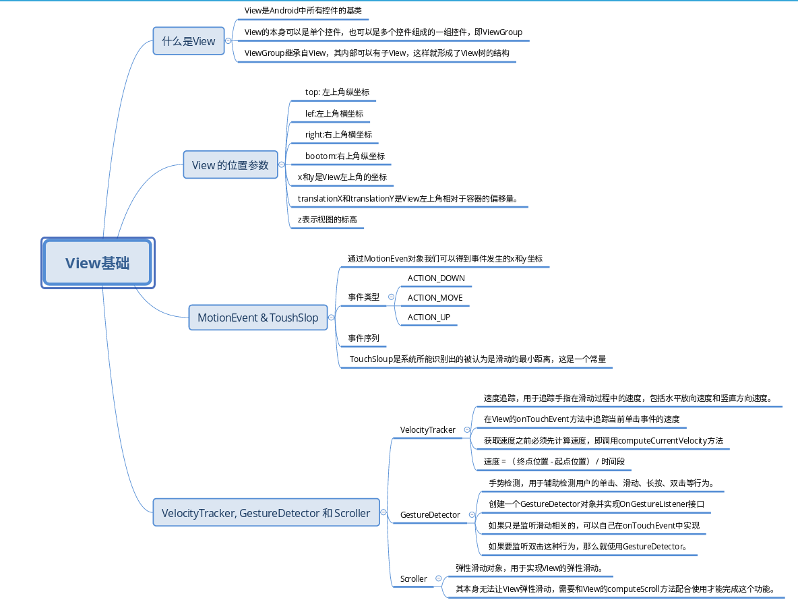
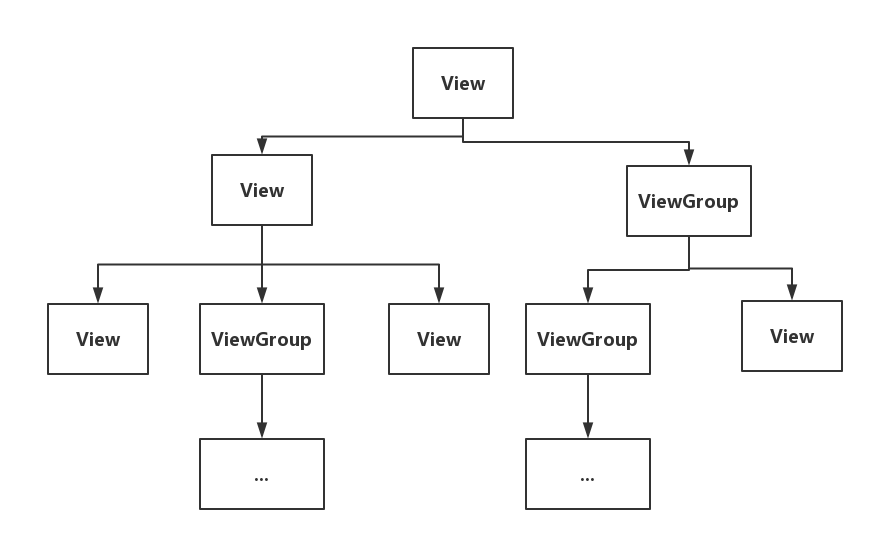
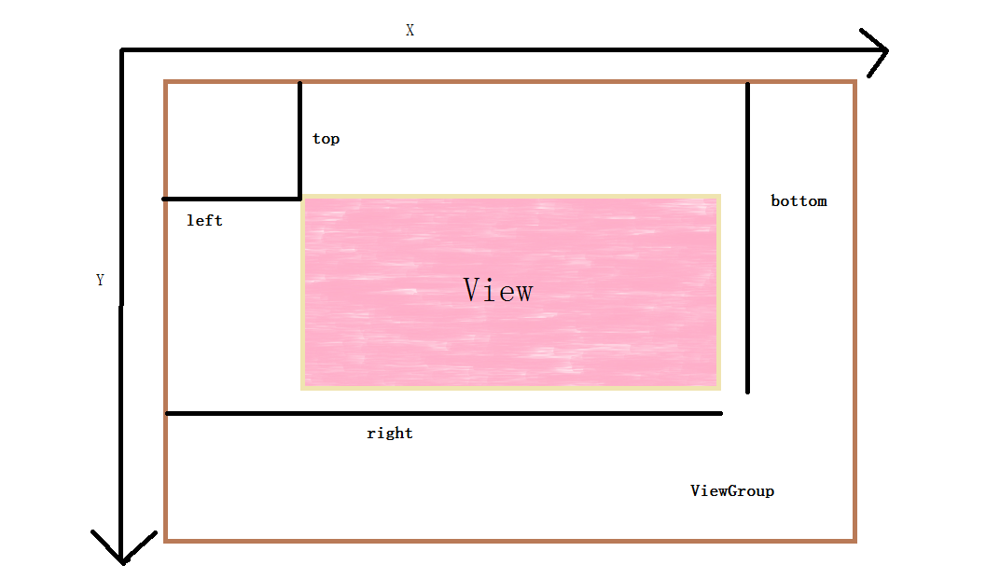
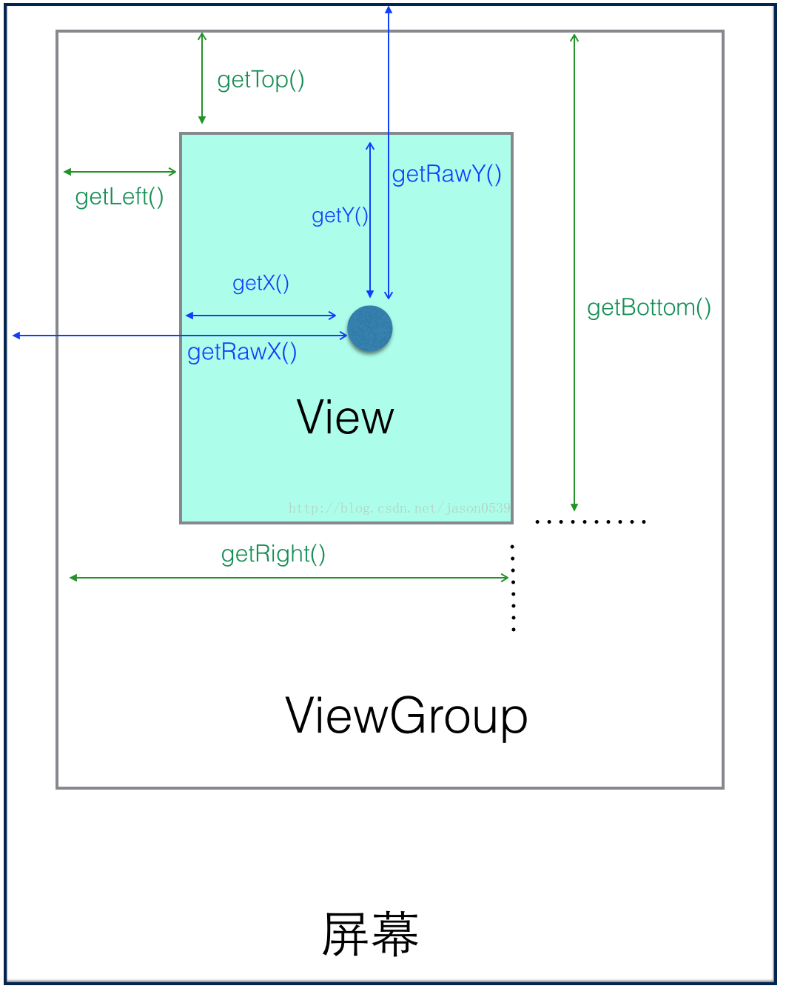
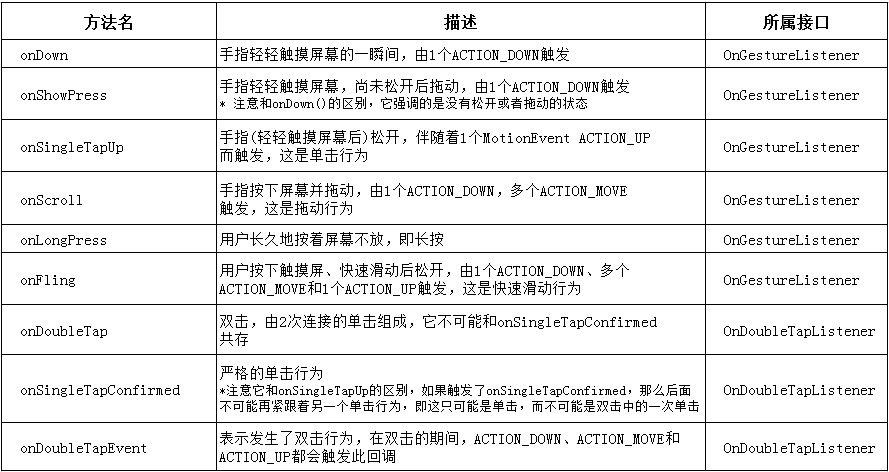

View基础

------

## 概述

View的位置参数、MotionEvent和TouchSlop对象、VelocityTracker、GestureDetector和Scroller对象。




## 什么是View

    View是Android中所有控件的基类，View的本身可以是单个控件，也可以是多个控件组成的一组控件，即ViewGroup，ViewGroup继承自View，其内部可以有子View，这样就形成了View树的结构。



## View 的位置参数

View 的位置主要有四个顶点决定的，分别对应View的四个属性: top、left、right、bottom. 这些顶点的坐标是相对于 View 的父容器来说，是一个相对坐标。

    top: 左上角纵坐标
    lef:左上角横坐标
    right:右上角横坐标
    bootom:右上角纵坐标

Andorid中，x轴和y轴的正方形分为右和下，不止是Android，大部分UI显示系统都是这个标准。

View的坐标和父容器的关系如下图（借用网上的图，侵删）：



**View的宽和高和坐标的关系: **

    width = right - left
    height = bottom - top

而这四个参数可以由以下方式获取:

```
    Left = getLeft();
    Right = getRight();
    Top = getTop();
    Bottom = getBottom();
```

 Android3.0后，View增加了x、y、translationX和translationY这几个参数。其中x和y是View左上角的坐标，而translationX和translationY是View左上角相对于容器的偏移量。
 
 他们之间的换算关系如下：

    x = left + translationX;
    y = top + translationY;

 top,left表示原始左上角坐标，而x,y表示变化后的左上角坐标。在View没有平移时，x=left,y=top。View平移的过程中，top和left不会改变，改变的是x、y、translationX和translationY。


### Android 5.0新添属性

在Android 5.0，对View又添加了一个新属性z，此新属性表示视图的标高，其确定：

    阴影的大小：具有较高Z值的视图会投射更大的阴影。
    绘制顺序：具有较高Z值的视图显示在其他视图的顶部。

View的Z值有两个组成部分：

* elevation：静态组件

  定义elevation属性：

    * XML中使用android:elevation属性
    * 代码中设置视图的View.setElevation() 


* translationZ：用于动画的动态组件。

    * Z = elevation + translationZ

在Material设计中，Z属性占了很大比重，由Z属性表示的视图的高程确定其阴影的视觉外观：具有较高Z值的视图投射较大，较柔和的阴影。 具有较高Z值的视图会遮挡具有较低Z值的视图; 但是，视图的Z值不会影响视图的大小。


### 动态获取View的位置

这里说的View相对屏幕的距离，是指View的左上角相对于手机屏幕左上角的坐标。可以使用以下几个方法获取：

    getLocationInWindow(int[])
    getLocationOnScreen(int[])
    getGlobalVisibleRect(Rect)
    getLocalVisibleRect()


## MotionEvent & ToushSlop

### MotionEvent

手指接触屏幕后产生的一些了事件中，事件类型有下面几种

    ACTION_DOWN 手指刚接触屏幕
    ACTION_MOVE 手指在屏幕上移动
    ACTION_UP 手指从屏幕上松开

点击事件类型

    点击屏幕后离开松开，事件序列为DOWN->UP
    点击屏幕滑动一会再松开，事件序列为DOWN->MOVE->…->MOVE->UP

通过MotionEven对象我们可以得到事件发生的x和y坐标，我们可以通过getX/getY和getRawX/getRawY得到。

它们的区别是：getX/getY返回的是相对于当前View左上角的x和y坐标，getRawX/getRawY返回的是相对于手机屏幕左上角的x和y坐标。



### TouchSloup

 TouchSloup是系统所能识别出的被认为是滑动的最小距离，这是一个常量，与设备有关，可通过以下方法获得：
 ```
 ViewConfiguration.get(getContext()).getScaledTouchSloup().
 ```

  当我们处理滑动时，比如滑动距离小于这个值，我们就可以过滤这个事件（系统会默认过滤），从而有更好的用户体验。

## VelocityTracker, GestureDetector 和 Scroller

### VelocityTracker

    速度追踪，用于追踪手指在滑动过程中的速度，包括水平放向速度和竖直方向速度。
 
 使用方法：

  * 在View的onTouchEvent方法中追踪当前单击事件的速度 
  ```
  VelocityRracker velocityTracker = VelocityTracker.obtain();
  velocityTracker.addMovement(event);
  ```

  * 计算速度，获得水平速度和竖直速度 
  ```
    velocityTracker.computeCurrentVelocity(1000);
    int xVelocity = (int)velocityTracker.getXVelocity();
    int yVelocity = (int)velocityTracker.getYVelocity();
  ```

   注意，获取速度之前必须先计算速度，即调用computeCurrentVelocity方法，这里指的速度是指一段时间内手指滑过的像素数，1000指的是1000毫秒，得到的是1000毫秒内滑过的像素数。速度可正可负：
   
    速度 = （ 终点位置 - 起点位置） / 时间段

   * 当不需要使用的时候，需要调用clear()方法重置并回收内存
   ```
    velocityTracker.clear();
    velocityTracker.recycle();
   ```

   ###  GestureDetector

    手势检测，用于辅助检测用户的单击、滑动、长按、双击等行为。
    
使用方法：

* 创建一个GestureDetector对象并实现OnGestureListener接口，根据需要，也可实现OnDoubleTapListener接口从而监听双击行为

```
GestureDetector mGestureDetector = new GestureDetector(this);
//解决长按屏幕后无法拖动的现象
mGestureDetector.setIsLongpressEnabled(false);
```

* 在目标View的OnTouchEvent方法中添加以下实现：
```
boolean consume = mGestureDetector.onTouchEvent(event);
return consume;
```

* 实现OnGestureListener和OnDoubleTapListener接口中的方法



其中常用的方法有：onSingleTapUp(单击)、onFling(快速滑动)、onScroll(拖动)、onLongPress(长按)和onDoubleTap（ 双击）。
建议：如果只是监听滑动相关的，可以自己在onTouchEvent中实现，如果要监听双击这种行为，那么就使用GestureDetector。

### Scroller

    弹性滑动对象，用于实现View的弹性滑动。其本身无法让View弹性滑动，需要和View的computeScroll方法配合使用才能完成这个功能。

使用方法
```
    Scroller scroller = new Scroller(mContext);
    //缓慢移动到指定位置
    private void smoothScrollTo(int destX,int destY){
        int scrollX = getScrollX();
        int delta = destX - scrollX;
        //1000ms内滑向destX,效果就是慢慢滑动
        mScroller.startScroll(scrollX,0,delta,0,1000);
        invalidata();
    } 
    @Override
    public void computeScroll(){
        if(mScroller.computeScrollOffset()){
        scrollTo(mScroller.getCurrX,mScroller.getCurrY());
        postInvalidate();
        }
    }
```

## 参考文档

[Android自定义View之View的位置参数](https://blog.csdn.net/io_field/article/details/56278426)

Android开发艺术探索